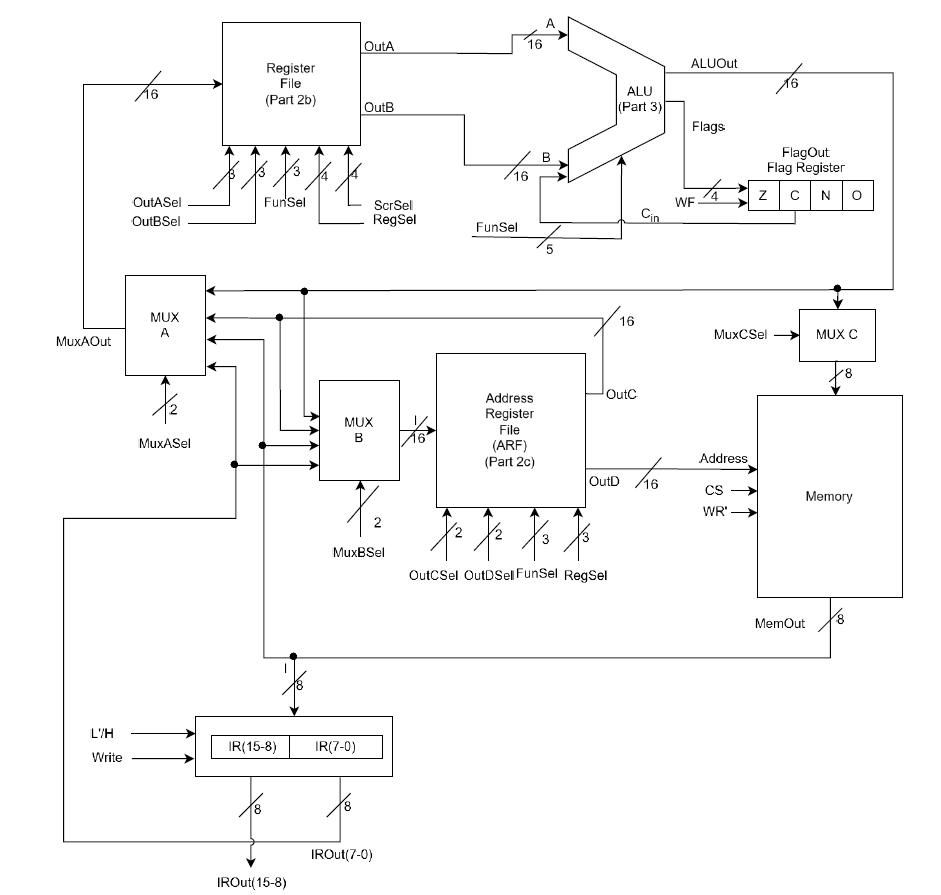

# Basic Computer in Verilog HDL

This project is about implementing and simulating a basic 16-bit computer using Verilog HDL on XILINX FPGA architecture, that have its own instruction set and hardwired control unit.

- For project guidelines see Guidelines/

- For more information about implementation see pdfs Report_1 / Report_2

## Features

 - Hardwired control unit with 34 instructions
 - Arithmetic Logic Unit performs 32 operations
 - ALU Flag registers: Zero/Carry/Negative/Overflow
 - General purpose registers

## Acknowledgements

 - General knowledge about computer organization
 - Working with registers, ALU's and hardwired control unit
 - Implementing relevant control signals for instructions

## Organization of the Project

## Authors

- [@TaskinOkmen](https://www.github.com/TaskinOkmen)